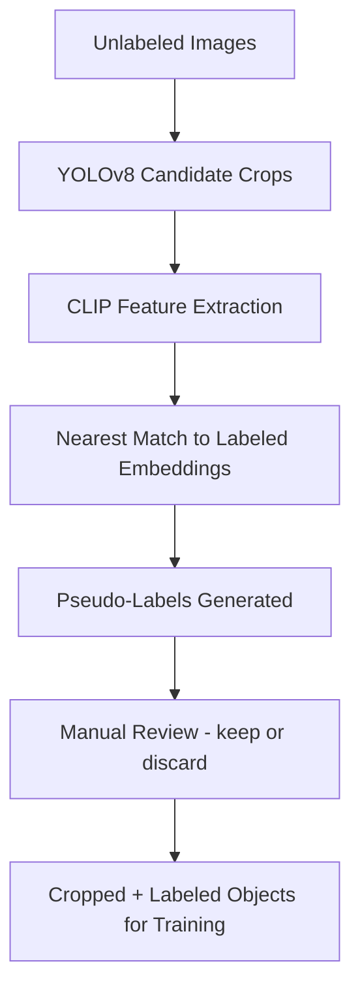

# Semi-Supervised Visual Labeling Pipeline

This repository contains a modular pipeline for generating and validating pseudo-labels on unlabeled image data using CLIP embeddings, YOLO detection, and manual curation. The goal is to reduce the burden of manual labeling in computer vision workflows by using similarity-based labeling and visual review. Note, this work is for images of objects not yet commonly seen by models, but those seen in manufacturing, such as tool identification, stock shape ID, and machine/process classifications. 

Validation will be performed on standard benchmark datasets (e.g. Pascal VOC or COCO), using a subset of images held out from training. To simulate pseudo-labeling on unfamiliar objects, all previously learned weights for object categories will be frozen, minimizing inherited model knowledge and approximating the performance on truly unlabled or novel classes. 

Evaluation will be based on the following metrics:
- mAP@IoU thresholds
- Precision
- Recall
- F1-score

This setup measures how effectively the pipeline proposes candidate objects, filters via visual review, and assigns meaningful labels, particularly in low-supervision or novel class scenarios. 

## Pipeline Overview



## Scripts

| Script | Purpose |
|--------|---------|
| `extract_frames.py` | Extract frames evenly from a video for dataset generation |
| `file_converter.py` | Convert `.heic` images to `.jpg` |
| `crop_images.py` | Crop labeled YOLO objects from original images |
| `yolo_candidate_crops.py` | Use pretrained YOLOv8 to crop candidate objects |
| `datavalidation.py` | GUI tool to manually approve or discard YOLO pseudo-labels |
| `extract_clip_features.py` | Extract CLIP features for candidate crops |
| `pseudo_labeling.py` | Assign pseudo-labels to new images using CLIP similarity |

## Folder Structure (Expected)

```
standard20/
├── standard/                  # Labeled images and labels
│   ├── standard_images/
│   └── standard_labels/
├── import/                   # Raw .heic files for conversion
├── unlabeled_images/        # Raw images for pseudo-labeling

method_verification/
├── yolo_candidate_crops/     # YOLO-generated object crops
├── yolo_pseudo_labels/       # Initial pseudo-labels from CLIP similarity
├── verified_images/          # User-kept images during manual review
├── verified_labels/          # Matched labels
├── difficult_images/         # Discarded images
├── bad_pseudo_labels/        # Discarded labels
```

## Requirements

Install dependencies:
```bash
pip install -r requirements.txt
```

Example packages used:
- `torch`, `open_clip_torch`, `tqdm`
- `opencv-python`, `Pillow`, `ultralytics`
- `pillow-heif` (for `.heic` conversion)

## How to Use

1. **Extract frames (optional):**
   ```bash
   python extract_frames.py
   ```

2. **Convert `.heic` files:**
   ```bash
   python file_converter.py
   ```

3. **Crop YOLO-labeled objects:**
   ```bash
   python crop_images.py
   ```

4. **Run YOLOv8 on unlabeled images:**
   ```bash
   python yolo_candidate_crops.py
   ```

5. **Visually validate detections:**
   ```bash
   python datavalidation.py
   ```

6. **Extract CLIP features:**
   ```bash
   python extract_clip_features.py
   ```

7. **Generate pseudo-labels:**
   ```bash
   python pseudo_labeling.py
   ```

## Author

Chloe Radigan
